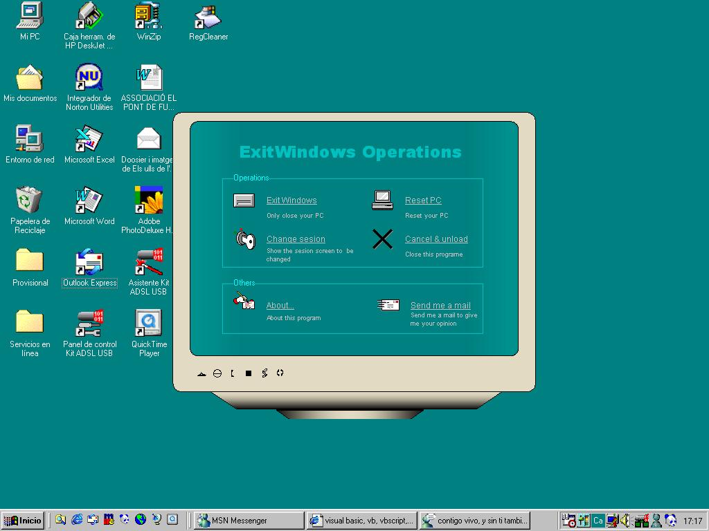

<div align="center">

## ExitWindows Operations Screen\!\!\!


</div>

### Description

This program has three functions: to close your PC, reebot and to change sesion.Try it please, you wont repent!vote me, please!
 
### More Info
 


<span>             |<span>
---                |---
**Submitted On**   |2002-09-06 02:36:52
**By**             |[Pau](https://github.com/Planet-Source-Code/PSCIndex/blob/master/ByAuthor/pau.md)
**Level**          |Beginner
**User Rating**    |5.0 (15 globes from 3 users)
**Compatibility**  |VB 6\.0
**Category**       |[Windows API Call/ Explanation](https://github.com/Planet-Source-Code/PSCIndex/blob/master/ByCategory/windows-api-call-explanation__1-39.md)
**World**          |[Visual Basic](https://github.com/Planet-Source-Code/PSCIndex/blob/master/ByWorld/visual-basic.md)
**Archive File**   |[ExitWindow127610962002\.zip](https://github.com/Planet-Source-Code/pau-exitwindows-operations-screen__1-38722/archive/master.zip)

### API Declarations

```
Public Declare Function ExitWindowsEx Lib "user32" (ByVal dwOption As Long, ByVal dwReserved As Long) as Long
```


